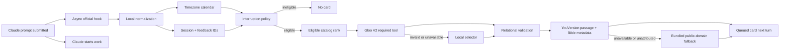

# Architecture

## Product flow



Claude Code's official spinner override is a separate surface. `spinner install` uses static owned copy plus references; `spinner sync` first obtains one live provider-selected and attributed moment, then safely installs it. The context-selected asynchronous card is not represented as a dynamic mid-turn spinner.

## Context model

The local normalizer emits only bounded, enumerated data:

- primary and secondary task labels;
- estimated wait bucket;
- workflow stage, previous outcome, repeated-task bucket, and effort bucket;
- locale, IANA-timezone window, tradition, and preferred tone;
- local calendar date, season, matching observance IDs, rank, and curated passage anchors;
- recent approved profile/snippet/passage IDs;
- high/low-rated approved IDs.

In `private` mode, task/workflow/outcome become `unknown`. In `local-labels`, prompt matching happens in process memory and the text is immediately discarded.

Session hashes use HMAC-SHA256 with a random, installation-local salt. The raw Claude session ID is not stored or transmitted.

## Calendar boundary

`src/calendar/liturgical.ts` computes the local civil date with `Intl.DateTimeFormat` and an IANA timezone. It includes Gregorian Easter computus, movable observances, fixed feasts, and seasonal ranges.

Tradition-specific commemorations are returned only for a matching explicit preference. The passage references are curated context anchors for a short demo moment; they are not represented as a complete official lectionary. Exact same-day anchors outrank seasonal and task-only choices.

## Provider and trust boundaries

| Boundary | Allowed | Explicitly forbidden |
|---|---|---|
| Hook to normalizer | Prompt in volatile process memory | Disk persistence or logging |
| Normalizer to Gloo | Enumerated context, calendar data, recent/feedback approved IDs | Raw prompt, code, filenames, path, transcript, session hash |
| Resolver to YouVersion | Version ID, USFM reference, locale | Prompt, code, identity, feedback |
| Local history | Salted session hash, approved IDs, timestamps | Prompt, verse/reflection text, source code |
| Local feedback | Trace/approved IDs, timestamp, 1–5 rating | Free text, prompt, verse/reflection text |
| Telemetry | Event, trace ID, coarse task, reason, booleans, rating | Prompt, code, Scripture text, email, path |
| Gloo output to UI | Validated IDs | Generated prose or ungrounded combinations |

The HTTP API uses a strict schema and rejects unknown fields, including `prompt`. Credentials never enter MCP arguments, cards, telemetry, test fixtures, notebook source/output, or documentation.

## Providers

| Component | Source | Behavior |
|---|---|---|
| Selector | Gloo `POST /ai/v2/chat/completions` | Direct tool-capable model, `tool_choice: "required"`, OAuth2 token cache |
| Optional selector | Gloo grounded completions | Requires an explicit project-owned RAG publisher |
| Scripture | YouVersion passage + Bible resources | Passage text/reference plus mandatory version/copyright metadata |
| Selector fallback | Deterministic on-device ranker | Same eligibility, calendar, feedback, and catalog constraints |
| Scripture fallback | Small bundled World English Bible set | Public domain and visibly labelled |

Gloo's 30-second timeout is intentionally larger than a chat-sized timeout because tool-capable cold routes can take longer. The Claude hook is asynchronous, so this does not delay Claude's work. Provider HTTP calls have one bounded retry for network errors, HTTP 429, and HTTP 5xx.

YouVersion Bible metadata is cached per version and locale. If the configured Bible language does not match the requested locale, Grace queries the licensed collection with `language_ranges=<language>*` and selects an attributed matching version. A passage is never displayed without a non-empty copyright/promotional attribution.

## Structured selection and validation

Gloo must call `select_grace_moment` with:

```json
{
  "momentProfileId": "wisdom-in-debugging",
  "reflectionSnippetId": "make-room-for-wisdom",
  "passageHint": "JAS.1.5",
  "durationSeconds": 5,
  "tone": "reflective",
  "confidence": 0.82,
  "fallbackVotd": false,
  "needsAuth": false,
  "reasonCodes": ["task-debugging"]
}
```

The function schema restricts every ID to the current eligible candidates. The service then performs a relational validation that the selected profile contains that exact snippet and passage and has that tone. It also rejects confidence below `0.55`, `needsAuth`, or verse-of-the-day fallback requests.

Provider reason codes are retained only for contract observability. User-visible explanations are independently re-derived from the event and the validated profile, preventing a model from claiming that a time, feast, workflow, or preference matched when it did not.

## Repetition and feedback

Histories are newest-first and bounded by the configured limit. The ranker:

1. penalizes recently shown profiles;
2. removes recent passages/snippets while unseen choices exist;
3. after saturation, chooses the least recently used candidate rather than collapsing to a stable repeat;
4. preserves exact feast anchors when they are fresh;
5. modestly boosts highly rated profiles and strongly de-prioritizes low-rated profiles/passages.

Feedback cannot introduce new content. All final choices remain inside the reviewed catalog.

## Provenance and failure behavior

Provenance has independent `selectorLive` and `scriptureLive` flags. Overall `live` is true only when both are true.

- Gloo auth/timeout/malformed output: local selector, then live YouVersion if available.
- Hallucinated, cross-wired, or low-confidence IDs: reject and select locally.
- YouVersion timeout, missing text, language failure, or missing attribution: use the selected profile's bundled fallback.
- Missing credentials: interactive commands report an actionable error; the async hook returns nothing.
- Hook crash or invalid input: return only `{"suppressOutput":true}` and never block Claude.
- Short wait, cooldown, cap, disabled state, or slash command: no automatic card.
- Telemetry failure: never suppress or block a moment.

The visible provider label is computed from the two live flags, not a generic success boolean.

## Packaging and verification

`esbuild` produces standalone Node 20 ESM entry points for the CLI, API, asynchronous hook, and MCP server. This is required because marketplace installs do not run arbitrary dependency installation.

The quality pipeline includes strict TypeScript, unit tests, contextual relevance tests, local HTTP contract doubles, API/hook/MCP integration tests, a 108-scenario evaluation, a 24-turn repeat simulation, clean bundle generation, and built-artifact smoke tests. Contract doubles live only under `tests/` and are never bundled.

`scripts/live-canary.ts` bypasses fallback swallowing and tests each provider directly. Its output contains only provider names, approved IDs, attribution presence, and privacy booleans. `scripts/build_notebook.py` regenerates and executes the Kaggle notebook from the current catalog/evaluation and uses private environment variables only for its live cell.
