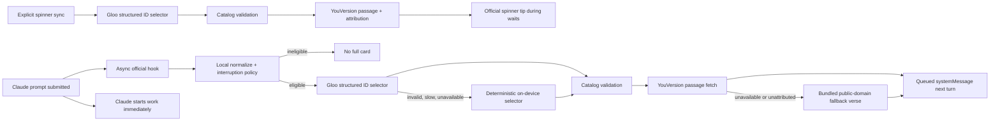

# Architecture

## Product flow



Grace requires live Gloo and YouVersion credentials. The spinner tip is the
opt-in wait-state surface: static mode uses project-owned micro-copy plus a
Scripture reference; `spinner sync` runs one live Gloo selection and YouVersion
resolution and installs a single provider-selected, attributed tip. The
asynchronous prompt hook queues the richer, context-labelled full card for the
next conversation turn — it never claims mid-turn delivery and never delays Claude.

## Trust boundaries

| Boundary | Allowed | Explicitly forbidden |
|---|---|---|
| Claude hook to normalizer | Prompt in process memory | Disk persistence or logging |
| Normalizer to Gloo | Surface, task label, duration bucket, locale, time window | Raw prompt, code, filenames, transcript path, working directory |
| Resolver to YouVersion | Version ID, USFM reference, locale | Prompt, code, identity |
| Telemetry | Event name, trace ID, coarse task label, reason, booleans, rating | Prompt, code, Scripture text, email, file paths |
| Gloo output to UI | IDs after schema and catalog validation | Generated prose or ungrounded passage choices |

The HTTP API applies a strict schema and rejects unknown fields, including
`prompt`. Provider credentials never enter MCP tool arguments, user-visible
responses, telemetry, or logs.

## Providers

| Component | Source | Notes |
|---|---|---|
| Selector | Gloo `/ai/v1/responses` (or grounded completions) | Strict JSON ID selection, OAuth2 client-credentials with token cache |
| Scripture | YouVersion `GET /v1/bibles/{id}/passages/{usfm}` + `GET /v1/bibles/{id}` | Text/reference from the passage endpoint; version name + required copyright from the Bible resource, fetched in parallel and cached |
| Selector fallback | On-device deterministic rule | Used only when Gloo is invalid/slow/unavailable; picks from the same approved catalog |
| Scripture fallback | Bundled public-domain (WEB) verses | Used only when YouVersion is unreachable; labelled `OFFLINE FALLBACK · PUBLIC DOMAIN` |

Provenance carries `live` (Scripture came from YouVersion) and `degraded` (a
fallback path was used), so a fallback card can never be mistaken for a live one —
the card label and status output are driven by those flags.

## Structured selection

Gloo receives the eligible catalog candidates and must return only:

```json
{
  "momentProfileId": "wisdom-in-debugging",
  "reflectionSnippetId": "make-room-for-wisdom",
  "passageHint": "JAS.1.5",
  "durationSeconds": 5,
  "tone": "reflective",
  "confidence": 0.82,
  "fallbackVotd": false,
  "needsAuth": false
}
```

The service rejects the result unless the profile, snippet, passage, and tone
exactly match a catalog candidate and confidence is at least `0.55`. No
model-generated sentence reaches the user.

## Failure behavior

- Gloo auth/model timeout or malformed JSON: select deterministically from the same eligible catalog (still live Scripture).
- Hallucinated or cross-wired IDs: reject and select on-device.
- YouVersion error, missing content, or missing copyright: render a bundled public-domain fallback verse, marked not-live.
- Missing credentials: the CLI/API/MCP report a clear, actionable message; the async hook simply shows nothing.
- Hook crash or invalid input: return only `{"suppressOutput":true}` and never block Claude.
- Short task, cooldown, cap, or disabled preference: do nothing.

## Runtime packaging

`esbuild` produces standalone Node 20 ESM entry points for the CLI, local API,
async hook, and MCP server. Each bundles its production dependencies and the
catalog. This is necessary because Claude Code copies marketplace plugins into a
cache and does not run `npm install` for arbitrary local source directories. The
contract-faithful HTTP doubles used by the test suite live under `tests/` and are
never bundled into the product.
